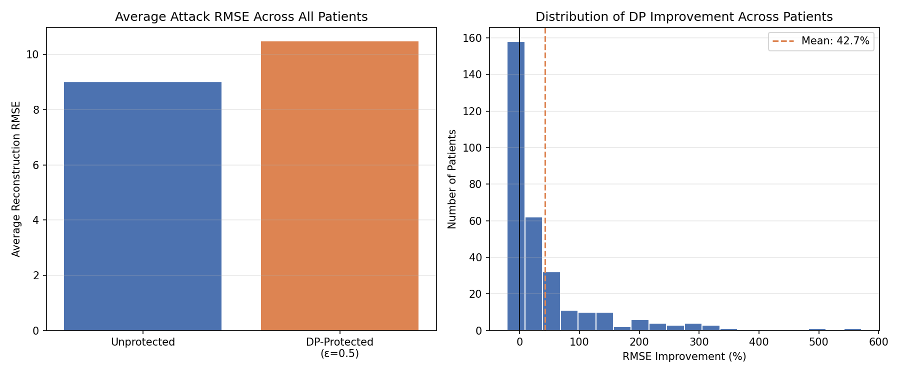

# Mitigating Model Inversion Attacks in Healthcare ML using Differential Privacy

[](https://github.com/begimaibb/healthcare-dp-mia/actions)
[](https://python.org)
[](LICENSE)

> **Paper**: *Mitigating Model Inversion Attacks in Healthcare ML using Differential Privacy*
> **Author**: Begimai Bolotbekova | Golden Gate University — MSBA 307
> **Advisor**: Dr. Rao Mikkilineni, PhD | December 2025

---

## Overview

Healthcare ML models trained on Electronic Health Records (EHRs) are vulnerable to
**Model Inversion Attacks (MIA)** — adversaries can repeatedly query a model's
prediction API to reconstruct sensitive patient attributes (age, BMI, A1C) without
ever accessing the underlying database.

This project demonstrates an **end-to-end privacy-preserving ML framework** that:

1. Trains a disease-risk classifier on synthetic EHR data (Synthea, 4000 patients)
2. Simulates a gradient-based MIA across all diabetic patients (308 patients)
3. Applies **ε-Differential Privacy** (Laplace mechanism, ε=0.5) at inference time
4. Exposes predictions via a secure Flask REST API
5. Deploys everything in a reproducible Docker container

---

## What is a Model Inversion Attack?

Imagine a hospital deploys an ML model that predicts diabetes risk. An attacker
doesn't have access to the patient database — but they CAN query the API thousands
of times. By analyzing the model's responses, they can reverse-engineer sensitive
patient details like age, BMI, and A1C values.

**Differential Privacy** stops this by adding carefully calibrated random noise to
every prediction — making reconstruction significantly harder while keeping the
model clinically useful.

---

## Key Results

| Metric | Value |
|---|---|
| Dataset | 4,000 synthetic patients (Synthea) |
| Model | Logistic Regression |
| Accuracy | 76% |
| Patients attacked | 308 diabetic patients |
| Avg RMSE unprotected | 8.99 |
| Avg RMSE protected (ε=0.5) | 10.47 |
| **Average DP improvement** | **+42.7%** ✅ |
| Best case improvement | +571.4% |

> **What is RMSE here?** It measures how wrong the attacker's guess is.
> Higher RMSE = attacker is further off = patient is better protected.
> A 42.7% average increase means DP makes the attacker nearly half as
> effective at reconstructing patient features.



---

## Architecture

```
Client Request
      │
      ▼
┌─────────────┐     ┌──────────────────┐     ┌───────────────────┐
│  Flask API  │────▶│  Logistic Reg.   │────▶│  Laplace Noise    │
│  /predict   │     │  Classifier      │     │  (ε-DP layer)     │
└─────────────┘     └──────────────────┘     └────────┬──────────┘
                                                       │
                                               Protected score
                                               returned to client
```

---

## Project Structure

```
healthcare-dp-mia/
├── src/
│   ├── process_data.py          # Parse Synthea FHIR JSON → CSV
│   ├── train_model.py           # Train logistic regression classifier
│   ├── differential_privacy.py  # Laplace & Gaussian DP mechanisms
│   ├── run_security_analysis.py # Simulate MIA across all patients
│   └── api.py                   # Flask REST API (DP-protected)
├── tests/
│   └── test_pipeline.py         # Unit tests — 6 passing ✅
├── models/                      # Saved .pkl artifacts (gitignored)
├── data/
│   └── synthea/                 # Raw FHIR JSON files (gitignored)
├── results/                     # KPI plots
├── .github/workflows/ci.yml     # GitHub Actions CI
├── Dockerfile                   # Multi-stage Docker build
├── requirements.txt
└── README.md
```

---

## Quick Start

### 1. Clone & install

```bash
git clone https://github.com/begimaibb/healthcare-dp-mia.git
cd healthcare-dp-mia
python -m venv venv
source venv/bin/activate
pip install -r requirements.txt
```

### 2. Add Synthea data

Download sample FHIR data from [synthea.mitre.org/downloads](https://synthea.mitre.org/downloads)
and place JSON files in `data/synthea/`.

### 3. Run the pipeline

```bash
# Step 1 — Process raw FHIR JSON
python src/process_data.py --input data/synthea/ --output data/processed_patient_data.csv

# Step 2 — Train the classifier
python src/train_model.py --data data/processed_patient_data.csv --output-dir models/

# Step 3 — Simulate MIA across all patients
python src/run_security_analysis.py --models-dir models/ --epsilon 0.5

# Step 4 — Start the API
python src/api.py
```

### 4. Query the API

```bash
curl -X POST http://localhost:5000/predict_risk \
  -H "Content-Type: application/json" \
  -d '{
    "age": 55,
    "gender_male": 1,
    "gender_female": 0,
    "latest_bmi": 30.24,
    "latest_a1c": 4.11
  }'
```

**Response:**
```json
{
  "risk_score": 0.7084,
  "epsilon": 0.5,
  "privacy_level": "ε=0.50 → Moderate — balanced noise and utility"
}
```

---

## Privacy Budget Guide

| ε (epsilon) | Privacy Level | Noise | Recommendation |
|---|---|---|---|
| 0.1 | Strong | High | May destabilize results |
| 0.5 | Moderate | Medium | **Default (this project)** |
| 1.0 | Standard | Low-medium | General healthcare ML |
| 10.0 | Minimal | Very low | Low-sensitivity data |

---

## Running Tests

```bash
pytest tests/ -v
```

All 6 tests pass ✅

---

## Docker Deployment

```bash
docker build -t healthcare-dp-mia .
docker run -p 5000:5000 \
  -e DP_EPSILON=0.5 \
  -v $(pwd)/models:/app/models \
  healthcare-dp-mia
```

---

## Limitations & Future Work

- Extend to real multi-institutional EHR datasets
- Evaluate stronger DP mechanisms (Rényi DP, zCDP)
- Add automated privacy auditing pipelines
- Incorporate fairness-aware DP across patient subgroups
- Expand Neo4j knowledge graph with medications and lab trends

---

## References

- Abadi et al. (2016). Deep learning with differential privacy. *ACM CCS*.
- Jayaraman & Evans (2019). Evaluating differentially private ML. *arXiv*.
- Liu, Chen & Song (2021). ML-Doctor: Holistic risk assessment. *arXiv*.
- OWASP Foundation (2023). Model inversion attack.
- Rajkomar et al. (2019). Machine learning in medicine. *NEJM*, 380(14).
- Tramèr et al. (2016). Stealing ML models via prediction APIs. *USENIX*.
- Xu et al. (2024). Differential privacy in health research. *JAMIA*, 31(5).

---

## License

MIT License — see [LICENSE](LICENSE) for details.